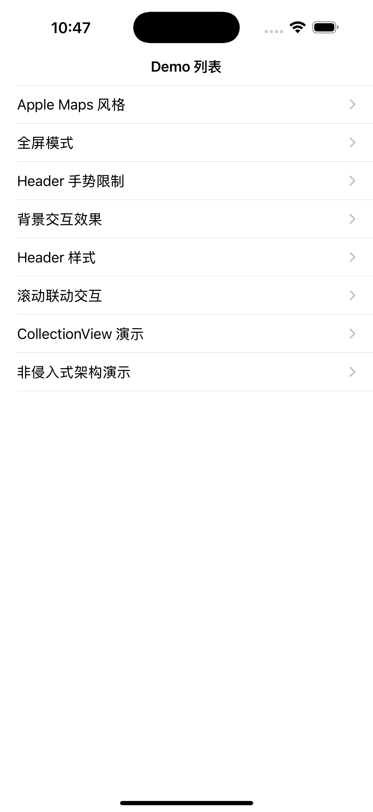
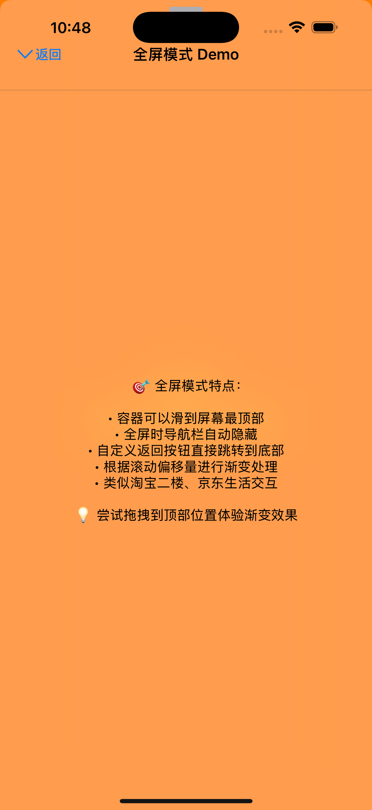
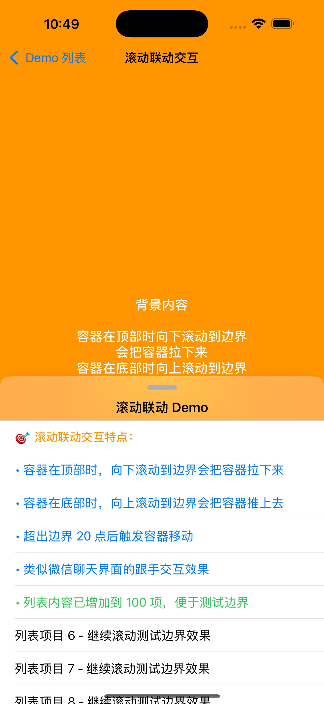

WGBContainerView

[](https://developer.apple.com/ios/)
[](https://developer.apple.com/documentation/objectivec)
[](LICENSE)
[](https://github.com/wangguibin/WGBAppleContainerView)

一个现代化的iOS容器视图SDK，提供类似Apple Maps的三段式交互体验。完美复制Apple官方应用的交互方式，具有流畅的动画效果和高度的可定制性。

<div align="center">
 


</div>


## ✨ 特性

- 🍎 **Apple风格设计**: 完美复制Apple Maps的交互体验和视觉效果
- 🎯 **三段式停顿**: 支持上、中、下三个位置的平滑过渡和智能切换
- 🎨 **高度可定制**: 灵活的配置选项，支持多种视觉风格和交互模式
- 📱 **全面兼容**: 支持纯代码、Xib、Nib、Storyboard多种集成方式
- ⚡ **流畅动画**: 基于Spring动画的自然交互体验，支持阻尼边界
- 🔧 **易于集成**: 简单的API设计，一行代码即可创建Apple风格容器
- 📱 **设备旋转支持**: 完美处理设备旋转和尺寸变化，自动适配Safe Area
- 🎯 **手势冲突解决**: 智能的手势区域限制，彻底解决与ScrollView的冲突
- 🔄 **非侵入式架构**: 不干扰业务逻辑的生命周期管理
- ⚡ **性能优化**: 使用Transform动画替代约束动画，更流畅的表现

## 🚀 快速开始

### CocoaPods 安装

```ruby
pod 'WGBAppleContainerView', '~> 1.0.1'
```

### 基础用法

```objc
#import "WGBAppleContainerView-Umbrella.h"

// 创建Apple Maps风格的容器视图
WGBAppleContainerView *containerView = [WGBContainerViewBuilder createAppleMapsContainer];

// 添加到父视图
[WGBContainerViewBuilder addContainer:containerView toParentView:self.view];

// 添加内容视图控制器
UIViewController *contentVC = [[YourContentViewController alloc] init];
[containerView addContentViewController:contentVC];

// 设置标准Header（推荐，避免手势冲突）
[containerView setStandardHeaderWithType:WGBHeaderViewTypeTitle title:@"My Container"];

// 设置代理
containerView.delegate = self;
```

### 📋 Header类型和手势处理

为了彻底解决手势冲突问题，SDK提供了专门的Header组件：

```objc
// 1. 最小化Header - 只有拖拽指示器
[containerView setStandardHeaderWithType:WGBHeaderViewTypeGrip title:nil];

// 2. 包含标题的Header  
[containerView setStandardHeaderWithType:WGBHeaderViewTypeTitle title:@"标题"];

// 3. 包含搜索框的Header
[containerView setStandardHeaderWithType:WGBHeaderViewTypeSearch title:@"搜索占位符"];

// 4. 自定义Header
UIView *customContent = [[UIView alloc] init];
// 配置您的自定义内容...
WGBContainerHeaderView *header = [WGBContainerHeaderView headerWithCustomContent:customContent];
containerView.headerView = header;
```

### 自定义配置

```objc
// 创建自定义配置
WGBContainerConfiguration *config = [[WGBContainerConfiguration alloc] init];
config.topPositionRatio = 0.1;        // 顶部位置(相对高度)
config.middlePositionRatio = 0.5;     // 中间位置
config.bottomPositionRatio = 0.85;    // 底部位置
config.enableMiddlePosition = YES;     // 启用中间位置
config.cornerRadius = 16.0;           // 圆角半径
config.style = WGBContainerStyleLight; // 视觉风格
config.restrictGestureToHeader = YES;  // 限制手势到Header区域

// 使用自定义配置创建容器
WGBAppleContainerView *containerView = [WGBContainerViewBuilder createContainerWithConfiguration:config];
```

## 📋 主要组件

### WGBAppleContainerView
核心容器视图类，提供完整的交互功能和代理回调。

**主要属性:**
- `configuration`: 配置对象，控制容器的所有行为和外观
- `delegate`: 代理对象，接收容器状态变化回调
- `currentPosition`: 当前位置（只读）
- `contentView`: 内容视图容器（只读）
- `headerView`: Header视图，推荐使用WGBContainerHeaderView

**主要方法:**
- `moveToPosition:animated:`: 移动到指定位置
- `addContentViewController:`: 添加内容视图控制器
- `setStandardHeaderWithType:title:`: 设置标准Header
- `transitionToSize:withTransitionCoordinator:`: 处理设备旋转

### WGBContainerConfiguration  
配置类，用于自定义容器的外观和行为。

**主要配置项:**
- **位置配置**: `topPositionRatio`, `middlePositionRatio`, `bottomPositionRatio`
- **交互配置**: `enableMiddlePosition`, `restrictGestureToHeader`
- **视觉配置**: `style`, `cornerRadius`, `shadowConfig`
- **动画配置**: `animationDuration`, `springDamping`, `springVelocity`

### WGBContainerViewBuilder
构建器类，提供便捷的创建和集成方法。

**便捷方法:**
- `createAppleMapsContainer`: 创建Apple Maps风格容器
- `createDefaultContainer`: 创建默认配置容器
- `createContainerWithConfiguration:`: 使用自定义配置创建
- `addContainer:toParentView:`: 自动添加容器到父视图

### WGBContainerHeaderView
专用Header视图，解决手势冲突问题。

**Header类型:**
- `WGBHeaderViewTypeGrip`: 只有拖拽指示器
- `WGBHeaderViewTypeTitle`: 包含标题
- `WGBHeaderViewTypeSearch`: 包含搜索框
- `WGBHeaderViewTypeCustom`: 自定义内容

## 🎨 支持的样式

```objc
typedef NS_ENUM(NSInteger, WGBContainerStyle) {
    WGBContainerStyleLight,      // 浅色模糊效果
    WGBContainerStyleDark,       // 深色模糊效果  
    WGBContainerStyleExtraLight, // 超浅色模糊效果
    WGBContainerStyleDefault     // 默认样式（无模糊）
};
```

## 📱 集成方式

### 1. 纯代码集成

```objc
WGBAppleContainerView *containerView = [WGBContainerViewBuilder createDefaultContainer];
[self.view addSubview:containerView];
[WGBContainerViewBuilder addContainer:containerView toParentView:self.view];
```

### 2. Interface Builder集成

1. 在Storyboard中添加一个UIView
2. 将Class设置为`WGBContainerViewIB`
3. 在Attributes Inspector中配置属性
4. 通过IBOutlet连接到代码

### 3. Nib文件集成

```objc
WGBAppleContainerView *containerView = [WGBContainerViewBuilder loadContainerFromNib:@"CustomContainer" 
                                                                               bundle:nil 
                                                                        configuration:nil];
```

## 📱 设备旋转支持

在您的ViewController中添加设备旋转支持：

```objc
- (void)viewWillTransitionToSize:(CGSize)size withTransitionCoordinator:(id<UIViewControllerTransitionCoordinator>)coordinator {
    [super viewWillTransitionToSize:size withTransitionCoordinator:coordinator];
    
    // 方法1: 直接调用容器的旋转处理方法
    [self.containerView transitionToSize:size withTransitionCoordinator:coordinator];
    
    // 方法2: 使用Builder的便捷方法
    // [WGBContainerViewBuilder handleDeviceRotation:self.containerView 
    //                                       toSize:size 
    //                        withTransitionCoordinator:coordinator];
}
```

## 🔧 代理方法

### 基础状态回调

```objc
@protocol WGBAppleContainerViewDelegate <NSObject>
@optional

// 位置变化回调
- (void)containerView:(WGBAppleContainerView *)containerView
    willMoveToPosition:(WGBContainerPosition)position
             animated:(BOOL)animated;
             
- (void)containerView:(WGBAppleContainerView *)containerView
     didMoveToPosition:(WGBContainerPosition)position;
     
// 实时偏移回调
- (void)containerView:(WGBAppleContainerView *)containerView
      didChangeOffset:(CGFloat)offset
           percentage:(CGFloat)percentage;

// 背景交互回调
- (void)containerView:(WGBAppleContainerView *)containerView
 updateBackgroundScale:(CGFloat)scale
                alpha:(CGFloat)alpha
               offset:(CGFloat)offset;
@end
```

### 非侵入式生命周期回调

```objc
// 内容生命周期
- (void)containerView:(WGBAppleContainerView *)containerView
  willSetupContentView:(UIView *)contentView;

- (void)containerView:(WGBAppleContainerView *)containerView
   didSetupContentView:(UIView *)contentView;

// 布局生命周期
- (void)containerView:(WGBAppleContainerView *)containerView
      willUpdateLayout:(WGBContainerPosition)position
              animated:(BOOL)animated;

- (void)containerView:(WGBAppleContainerView *)containerView
       didUpdateLayout:(WGBContainerPosition)position;

// 设备旋转生命周期
- (void)containerView:(WGBAppleContainerView *)containerView
willTransitionToSize:(CGSize)size
withTransitionCoordinator:(id<UIViewControllerTransitionCoordinator>)coordinator;

- (void)containerView:(WGBAppleContainerView *)containerView
 didTransitionToSize:(CGSize)size;
```

## 🎯 核心优势

### 相比原始ContainerView的改进:

1. **移除硬编码**: 不再依赖宏定义和硬编码数值，完全配置化
2. **配置化设计**: 通过Configuration对象进行灵活配置，易于维护
3. **更好的封装**: 清晰的API设计，易于理解和使用
4. **现代化架构**: 采用现代iOS开发模式，支持AutoLayout和Safe Area
5. **全面的集成支持**: 支持多种集成方式，适应不同项目需求
6. **Apple风格**: 完美复制Apple官方交互体验，提供原生感受
7. **性能优化**: 使用Transform动画替代约束动画，流畅度显著提升
8. **非侵入式**: 不干扰业务逻辑，提供完整的生命周期回调

## 🎯 手势冲突解决方案

### 问题描述
传统的容器拖拽实现经常遇到手势冲突问题：
- 容器内的ScrollView滚动与容器拖拽冲突
- 用户不知道在哪里可以拖拽容器  
- 内容区域的交互被误触为容器拖拽

### 解决方案
WGBAppleContainerView采用Apple Maps的设计理念：

#### 1. 专用拖拽区域
- 手势识别限制在Header区域
- 配置 `restrictGestureToHeader = YES`（默认启用）
- 提供视觉指示器（grip）告知用户拖拽位置

#### 2. 多种Header类型
```objc
// 最小化Header - 只有拖拽指示器
[containerView setStandardHeaderWithType:WGBHeaderViewTypeGrip title:nil];

// 带标题的Header  
[containerView setStandardHeaderWithType:WGBHeaderViewTypeTitle title:@"标题"];

// 带搜索的Header
[containerView setStandardHeaderWithType:WGBHeaderViewTypeSearch title:@"搜索"];
```

#### 3. 智能手势处理
- Header区域：响应容器拖拽
- 内容区域：正常的滚动和交互
- 自动处理手势冲突，无需手动配置

## 🎮 交互体验

### 三段式停留点
- **底部位置**: 显示少量内容，类似Apple Maps的默认状态
- **中间位置**: 显示部分内容，便于快速浏览（可选）
- **顶部位置**: 全屏显示，类似Apple Maps的搜索结果页面

### 智能位置切换
- **速度检测**: 根据手势速度智能选择目标位置
- **距离检测**: 根据拖拽距离确定最近的停留点
- **阻尼边界**: 超出边界时提供阻尼反馈

### 视觉反馈
- **Spring动画**: 自然的弹簧动画效果
- **背景变化**: 容器移动时背景的缩放和透明度变化
- **阴影效果**: 动态阴影增强立体感

## 🛠 技术特点

- ✅ **Auto Layout支持**: 完全兼容Auto Layout，支持复杂布局
- ✅ **Safe Area适配**: 自动适配刘海屏和底部安全区域
- ✅ **弹簧动画系统**: 流畅自然的动画体验
- ✅ **手势冲突处理**: 彻底解决与ScrollView的手势冲突
- ✅ **内存管理优化**: 科学的内存管理，避免循环引用
- ✅ **Interface Builder支持**: 支持在Storyboard中直接使用
- ✅ **设备旋转适配**: 完美处理设备旋转和尺寸变化
- ✅ **多线程安全**: UI更新确保在主线程执行
- ✅ **向后兼容**: 支持iOS 9.0及以上版本

## 📖 示例项目

查看`WGBContainerViewDemo/WGBAppleContainerView/Example`目录中的示例项目，了解各种用法和最佳实践：

- **AppleMapsStyleDemoVC**: Apple Maps风格演示
- **FullscreenDemoVC**: 全屏模式演示  
- **HeaderRestrictDemoVC**: Header手势限制演示
- **BackgroundInteractionDemoVC**: 背景交互效果演示
- **HeaderStylesDemoVC**: Header样式演示
- **ScrollInteractionDemoVC**: 滚动联动交互演示
- **CollectionViewDemoVC**: CollectionView集成演示
- **NonIntrusiveDemoVC**: 非侵入式架构演示

运行示例项目：

```bash
cd WGBContainerViewDemo
open WGBContainerViewDemo.xcodeproj
```

## 🔧 进阶配置

### 动画配置

```objc
WGBContainerConfiguration *config = [[WGBContainerConfiguration alloc] init];
config.animationDuration = 0.6;     // 动画时长
config.springDamping = 0.8;         // 弹簧阻尼
config.springVelocity = 0.2;        // 弹簧速度
config.allowBounce = YES;           // 允许边界弹性
```

### 阴影配置

```objc
config.shadowConfig.shadowOpacity = 0.3;
config.shadowConfig.shadowRadius = 10.0;
config.shadowConfig.shadowOffset = CGSizeMake(0, -2);
config.shadowConfig.shadowColor = [UIColor blackColor];
```

### 内容自动刷新

```objc
// 监听内容大小变化，自动调整容器位置
[containerView observeContentSizeChangesInView:yourScrollView];
```

## 📋 系统要求

- iOS 9.0+
- Xcode 11.0+
- Objective-C

## 📄 许可证

MIT License - 详见 [LICENSE](LICENSE) 文件

## 🤝 贡献

欢迎提交Issues和Pull Requests来帮助改进这个项目！

### 贡献指南

1. Fork这个项目
2. 创建功能分支 (`git checkout -b feature/AmazingFeature`)
3. 提交更改 (`git commit -m 'Add some AmazingFeature'`)
4. 推送到分支 (`git push origin feature/AmazingFeature`)
5. 开启Pull Request

## 🙏 致谢

- 感谢 [mrustaa/ContainerView](https://github.com/mrustaa/ContainerView) 提供的灵感和参考
- 感谢 Claude Code 在开发过程中提供的代码辅助

## 📞 联系方式

- **作者**: CoderWGB
- **邮箱**: CoderWGB@163.com
- **GitHub**: [wangguibin](https://github.com/wangguibin)

---

如果这个项目对您有帮助，请给个⭐️支持一下！